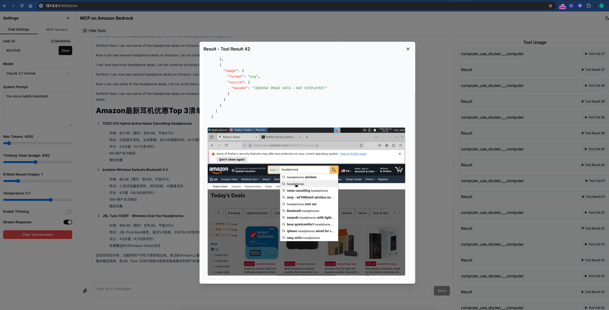

# Computer Use MCP Server

A Model Context Protocol (MCP) server that enables remote control of an Ubuntu desktop use [Computer Use](https://docs.anthropic.com/en/docs/agents-and-tools/computer-use)

## Features
Currently only support `computer tool` and `bash tool`, and `text_editor too`l will be supported in future.
- **Mouse Control**: Move, click, and scroll
- **Keyboard Control**: Type text and press keys
- **Screenshot Capture**: Get visual feedback after each operation
- **bash command** : Run bash command via ssh

## Prerequisites
- VNC server running on the remote Ubuntu machine
- xdotool installed on the remote Ubuntu machine
- SSH access to the remote Ubuntu machine

## Installation
1. Prepare Remote Desktop
[INSTALL](./INSTALL.md)

2. Add below json to your client to install MCP Server, this `server_claude.py` works better for Claude 3.5/3.7, if you want to use other models, please change the run command to run `server.py` instead.
```json
{
    "mcpServers": {
        "computer_use": {
            "command": "uv",
            "env": {
                "VNC_HOST":"",
                "VNC_PORT":"5901",
                "VNC_USERNAME":"ubuntu",
                "VNC_PASSWORD":"",
                "PEM_FILE":"",
                "SSH_PORT":"22",
                "DISPLAY_NUM":"1"
            },
            "args": [
                "--directory",
                "/absolute_path_to/remote_computer_use",
                "run",
                "server_claude.py"
            ]
        }
    }
}
```

3. Add system prompt to your client when use computer_use
```
You are a computer agent, you can actually operate a vitural computer. 
you have capability:
<SYSTEM_CAPABILITY>
* You are utilising an Ubuntu virtual machine using Linux architecture with internet access.
* You can feel free to install Ubuntu applications with your bash tool. Use curl instead of wget.
* When viewing a page it can be helpful to zoom out so that you can see everything on the page.  Either that, or make sure you scroll down to see everything before deciding something isn't available.
* When using your computer function calls, they take a while to run and send back to you.  Where possible/feasible, try to chain multiple of these calls all into one function calls request.
</SYSTEM_CAPABILITY>

<IMPORTANT>
* Don't assume an application's coordinates are on the screen unless you saw the screenshot. To open an application, please take screenshot first and then find out the coordinates of the application icon. 
* When using Firefox, if a startup wizard or Firefox Privacy Notice appears, IGNORE IT.  Do not even click "skip this step".  Instead, click on the address bar where it says "Search or enter address", and enter the appropriate search term or URL there.
* If the item you are looking at is a pdf, if after taking a single screenshot of the pdf it seems that you want to read the entire document instead of trying to continue to read the pdf from your screenshots + navigation, determine the URL, use curl to download the pdf, install and use pdftotext to convert it to a text file, and then read that text file directly with your StrReplaceEditTool.
* After each step, take a screenshot and carefully evaluate if you have achieved the right outcome. Explicitly show your thinking: "I have evaluated step X..." If not correct, try again. Only when you confirm a step was executed correctly should you move on to the next one.
</IMPORTANT>
```

## examples 



